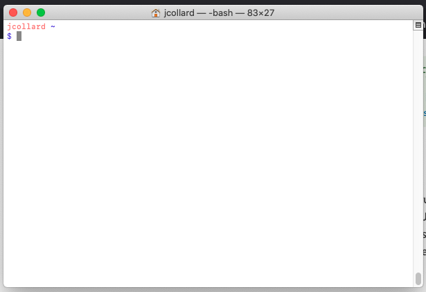
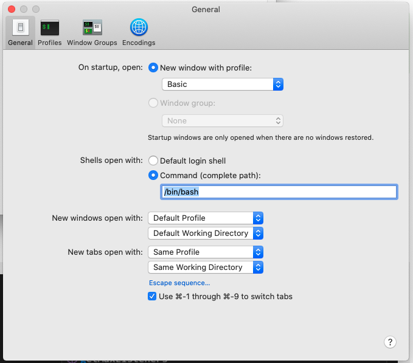

# Student Log

## Overview

This project will serve as a log of your progress throughout the entirety of
this course.

* [Required Software](#required-software)
  * [Install Git](#install-git)
  * [Install VSCode](#install-vscode)
* [Create a Github account](#create-a-github-account)
* [Sign up for this project](#sign-up-for-this-project)
* [Terminal Basics](#terminal-basics)
  * [Starting a terminal](#starting-a-terminal)
  * [Navigating directories](#navigating-directories)
  * [Creating a directory](#creating-a-directory)
  * [Clone your repository](#clone-your-repository)
  * [Running the setup script](#TODO)
  * [The develop branch](#TODO)
  * [Making a Commit](#TODO)
  * [Pushing a Commit](#TODO)
* [Creating a Pull Request]

## Required Software

### Install Git

For the vast majority of your projects and assignments, you will be using `Git`.
Git is a version control system (VCS). You can think of a VCS as a tool that
helps track your changes and keep backup copies of your previous work.

Instructions for installing Git can be found here:
[https://git-scm.com/book/en/v2/Getting-Started-Installing-Git](https://git-scm.com/book/en/v2/Getting-Started-Installing-Git).
Note: You will need to scroll down to find the specific instructions for your
operating system.

### Install VSCode

VSCode is a widely used and customizable IDE (Interactive Development
Environment). You can think of it as a very fancy (and powerful) text editor. 

You can download VS Code here:
[https://code.visualstudio.com/download](https://code.visualstudio.com/download)

#### Additional Instructions for Mac

To install VS Code, you must first extract the zip archive. Then, you must drag
the program "Visual Studio Code" into your Applications.

After it is in your applications, you can launch it in the Spotlight Search
(Command+Space) by typing in "VS Code".

The last step is to Install `code` in your shell. To do this:

1. Open VS Code
2. Open the command pallet (Command + Shift + P) then type `Shell`
3. Select the option `Shell Command: install code command in PATH`

## Create a Github account

Github is a widely used platform for hosting Git repositories as well as
provides a set of tools which helps to facilitate collaboration on software
projects. Additionally, Github is widely used in the industry.

In this class, we will utilize Github to host our source code and submit
projects for feedback and grading.

If you do not already have an account, sign-up here:
[https://github.com/signup](https://github.com/signup)

*Note*: You can associate multiple emails with one account. Be sure your
Chadwick email is one of the associated emails.

## Sign up for this project

TODO

## Terminal Basics

The `terminal` is a program that allows you to access a `shell`. A `shell` is a
program which allows you to send commands to your operating system. In this
class, the word `terminal` and `shell` will be used almost synonymously.

### Starting a Terminal

#### Windows

If you're using Windows and have already installed `Git`. You now have a program
called `git bash` that will use as your terminal and shell for this class. You
can launch it by right clicking on a folder and selected `git bash`. This will
open the terminal starting in that folder.

#### Mac
On Mac, you can start the terminal using the Spotlight Search (Commnad+Space)
and then searching for terminal. When it opens, it should look something like
the image below. *Note*: It may look a little different, we will be configuring
your terminal next.

##### Using Bash
By default, Mac uses a `shell` called `zsh`. In this class, you are expected to
use `bash`. To change this setting, select your terminal window. Then, in the
top menu select `Terminal` > `Preference`.

Next, select the General Tab.

In the section that says, `Shells open with:` select `Command`, then enter
`/bin/bash`.

You will need to restart your terminal for this to take effect. Go ahead and
exit the termina and restart it now.

### Listing File Contents

If you start the terminal normally, it will launch a shell in your `HOME`
directory. You can list all of the files in the current directory you are in by
typing the command `ls` which is short for List.

### Navigating Directories

You may be more familiar with the word "folder" as that is what is used visually
on most computers to represent a directory. When we use the word directory in
this class, we are referring to a specific location or "PATH" on a computer.

To see which directory your shell is currently in, you can run the `pwd` command
which stands for "Print Working Directory".

This will print out the full path to your current location. On Mac, you can run
the `open .` command to open Finder at the shell's current location.

To access files in different locations, you can navigate between directories by
using the `cd` command which stands for Change Directory. This command expects
an argument to be provided.

For example, `cd Desktop` will change to the Desktop directory if one exists at
the current location. In the previous example, we say that `cd` is the command
and `Desktop` is the argument. Try the following sequence of commands:

1. `cd $HOME`
2. `pwd`
3. `cd Desktop`
4. `pwd`
5. `cd ..`
6. `pwd`
7. `cd .`
8. `pwd`

What do you think the `$HOME` argument means? What do you think the `..` argument means?

There are two several special directories that are always available in the terminal. Here are three of them:

* `$HOME` - This refers to the current users `HOME` directory
* `.` - This refers to the current directory
* `..` - This refers to the parent directory and allows you to navigate "backwards"

### Creating a Directory

In the terminal, you can create new directories using the `mkdir` command which
stands for Make Directory. This command expects one or more arguments to be provided.

If you wanted to make multiple directories you would run the command:

`mkdir dir-1 dir-2 dir-3`

In the above example, `mkdir` is the command, `dir-1` is argument 1, `dir-2` is
argument 2, and `dir-3` is argument 3. This example would result in 3 new
directories being created `dir-1`, `dir-2`, and `dir-3`.

Try the following commands:

1. `cd $HOME`
2. `mkdir ap-compsci-principles` (*Note*: use hyphens to avoid making 3 directories!)
3. `ls`
4. `cd ap-compsci-principles`
5. `pwd`

If all went well, you should now be inside of your new directory.

### Clone your repository

#### Double Check Installation

Before you can run this step, you need to ensure you have `git` installed. Run
the following command:

`git --version`

If all goes well, you should see a response similar to this: `git version
2.15.0`. If not, you need to install `git` using the instructions above.

#### Locate your project

### Running the setup script

### The develop branch

### Making a commit

### Pushing a commit

## Creating a Pull Request