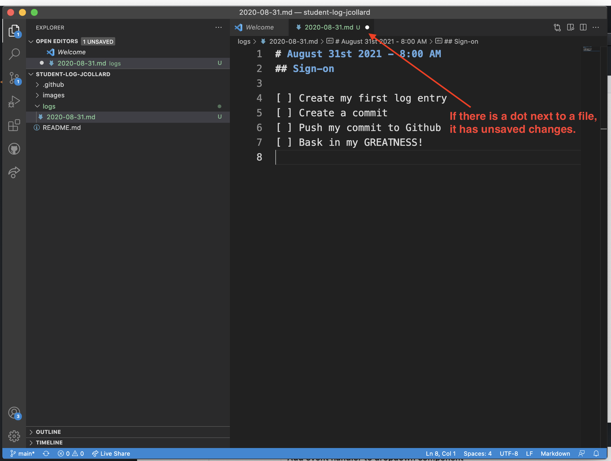
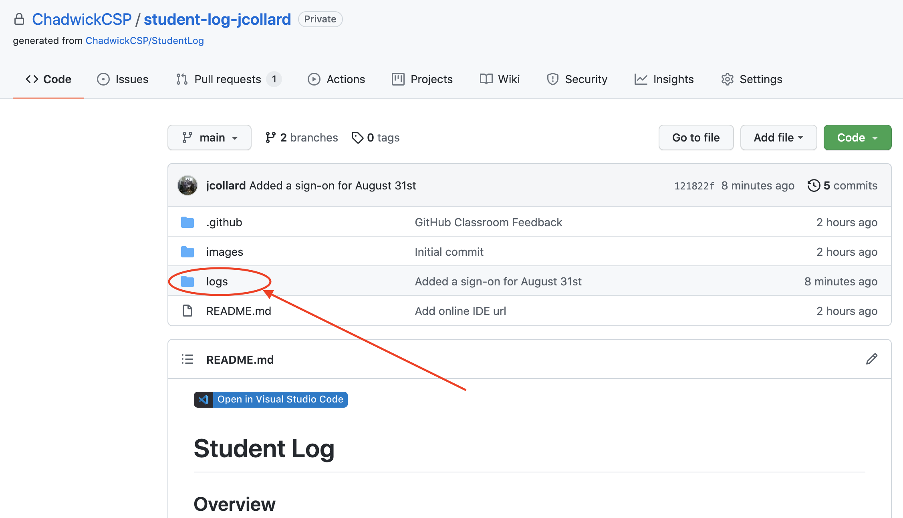

# Student Log

## Overview

The student log is your life line to track your progress as well as keep your
instructor abreast. The expecation in this class is that you will create a
sign-on and sign-off each time you work on something for this class. This is a
major part of your Skills of a Student and Effort Grade.

* [Required Software](#required-software)
  * [Install Git](#install-git)
  * [Install VSCode](#install-vscode)
* [Create a Github account](#create-a-github-account)
* [Sign up for this project](#sign-up-for-this-project)
  * [Install GitHub Desktop](#install-github-desktop)
  * [Cloning your Student Log](#cloning-your-student-log)
  * [VSCode as External Editor](#vscode-as-external-editor)
* [Creating your first Sign-on Log Entry](#creating-your-first-sign-on-log-entry) 
  * [The Log File](#the-log-file)
  * [Creating a Commit](#creating-a-commit)
  * [Pushing your commit to Github](#pushing-your-commit-to-github)
  * [Verifying your work](#verifying-your-work)
  * [Creating your first Sign-off Log Entry](#creating-your-first-sign-off-log-entry)

## Required Software

### Install Git

For the vast majority of your projects and assignments, you will be using `Git`.
Git is a version control system (VCS). You can think of a VCS as a tool that
helps track your changes and keep backup copies of your previous work.

Instructions for installing Git can be found here:
[https://git-scm.com/book/en/v2/Getting-Started-Installing-Git](https://git-scm.com/book/en/v2/Getting-Started-Installing-Git).
Note: You will need to scroll down to find the specific instructions for your
operating system.

### Install VSCode

VSCode is a widely used and customizable IDE (Interactive Development
Environment). You can think of it as a very fancy (and powerful) text editor. 

You can download VS Code here:
[https://code.visualstudio.com/download](https://code.visualstudio.com/download)

#### Additional Instructions for Mac

To install VS Code, you must first extract the zip archive. Then, you must drag
the program "Visual Studio Code" into your Applications.


After it is in your applications, you can launch it in the Spotlight Search
(Command+Space) by typing in "VS Code".

The last step is to Install `code` in your shell. To do this:

1. Open VS Code
2. Open the command pallet (Command + Shift + P) then type `Shell`
3. Select the option `Shell Command: install code command in PATH`


## Create a Github account

Github is a widely used platform for hosting Git repositories as well as
provides a set of tools which helps to facilitate collaboration on software
projects. Additionally, Github is widely used in the industry.

In this class, we will utilize Github to host our source code and submit
projects for feedback and grading.

If you do not already have an account, sign-up here:
[https://github.com/signup](https://github.com/signup)

*Note*: You can associate multiple emails with one account. Be sure your
Chadwick email is one of the associated emails.

## Sign up for this project

After you have an account and are logged in. You can sign up for this project
here:
[https://classroom.github.com/a/fB_ElDob](https://classroom.github.com/a/fB_ElDob)

From this page, you must click `Accept this Assignment`. This will create a
personal copy of this git repository for you. You will need to wait for the
repository to be created. Then, click refresh in your browser.

Follow the URL to access your repository. It should look like
`https://github.com/ChadwickCSP/student-log-XXXXXX` where `XXXXXX` is your
Github username. You should bookmark this page as it is your reference to your
personal project.


### Install GitHub Desktop
To get your project downloaded, you will need to install GitHub Desktop. You can
find it here: [https://desktop.github.com/](https://desktop.github.com/)

When you launch GitHub Desktop for the first time, you will need to login to your Github account.

Next, it will ask you to configure git. You should use your school email address.

### Cloning your Student Log

Clone your student log repository. This creates a local copy of your project on
your computer.


Take note of the `Local Path`. You can change this to a different location if
you would like. Click Clone.

###  VSCode as External Editor

Click the Preferences link on the main screen of your repository.

Select the Integrations tab on the left.

Ensure that `External Editor` is set to `Visual Studio Code`.

Click Save.

## Creating your first Sign-on Log Entry

### The Log File

Click the `Open in Visual Studio Code` button. This will open up a workspace for
the student-log project.


Right click on the `logs` folder and select `New File`.


Each log file should be named using the current date with the following format:
`YYYY-MM-DD.md`. For example, `2021-08-31.md` would be the file containing all
log entries for the August 31st 2021.

The `md` at the end of the filename is called a file extension. This stands for
Mark Down which is the file format we will use for the majority of documents you
write in this course. You can find a cheat sheet for markdown here:
[https://www.markdownguide.org/cheat-sheet/](https://www.markdownguide.org/cheat-sheet/)

Next, you need to create a sign-on entry for your work. Enter the following in
the log file, replacing the date and time with the current date and time.

```markdown
# August 31st 2021
## Sign-on - 8:00 AM

- [ ] Create my first log entry
- [ ] Create a commit
- [ ] Push my commit to Github
- [ ] Bask in my GREATNESS!
```

Each log file begins with a header denoted with `#` with the date.

Each log entry begins with a sub-header `##` indicating what type of log entry
this is: `Sign-on` or `Sign-off` and the time that the entry was created.

Finally, the entry contains a list of actionable items to be completed. Each
item begins with a `- [ ]` followed by a description of what you hope to
complete or what was completed. *Note*: The formatting here is important; you
must include the hyphen and spacing.

Once you are done creating your first sign-on, make sure to save your work on
Mac use (Command + S) on Windows use (Ctrl + S).



### Creating a Commit

After you've created your first log-entry, you must perform a commit. A commit
is the process of creating a "version" of your work. You can think of this as a
snapshot of the project at a specific moment in time.

To do this in VSCode, access the Source Control tab by clicking the Source
Control icon on the left side of the screen.


On this screen, you can see a list of the files that have been created or
modified since the last commit.

Click the add icon next to `stage` the log to be committed. A staged file has
been marked to be committed but has not yet been committed. This allows you the
ability to add several files in a single commit.


Next, add a message describing what you did for this commit in the message box
at the top of the interface.


Finally, click the commit icon at the top of the interface to perform the
commit.


After clicking it, you'll notice that the changes list will be empty. This means
there have been no changes since you made your commit.

### Pushing your commit to Github

When you make a commit, the work is only stored on your computer. To publish
your changes to Github, you must perform a push.

To do this, you will return to GitHub desktop. You'll now see there is an option
to `Push origin`. Click this button to publish your log entry.


### Verifying your work

The last step is to verify your log entry is available on GitHub so that your
instructor can see it.

Navigate to your project URL that you bookmarked earlier. Then, click on the
`logs` directory.



If all went well, you should see your log entry file here. Click on it.


You will now see the markdown you wrote converted into a nicely formatted
sign-on entry. *Note:* If your entry doesn't have a nice task list like the
image below, your formatting is not correct. Go back to the previous step and
update your entry to match the exact formatting.


## Creating your first Sign-off Log Entry

Now that you've finished creating your first sign-on, you must create a sign-off
marking each of the items you completed.

Check the date and time. If necessary, create a new log file with the current
date. Then, create a new entry for the current time and denote it is a
`sign-off`.

When you create a sign-off, you should update your list to have any items you
completed that were not present. As well as marking off the items that were
completed.

In essence: A sign-on says what you hope to accomplish and a sign-off says what
was actually done. 

Your log entry should look similar to this when you're finished.

```markdown
# August 31st 2021
## Sign-on - 8:00 AM

- [ ] Create my first log entry
- [ ] Create a commit
- [ ] Push my commit to Github
- [ ] Bask in my GREATNESS!

## Sign-off - 8:42 AM

- [X] Create my first log entry
- [X] Create a commit
- [X] Push my commit to Github
- [X] Created a sign-off
- [X] Bask in my GREATNESS!
```

Finally, save, commit, and push your log entry to Github.

Congratulations! You've just setup your Student Log for the year!